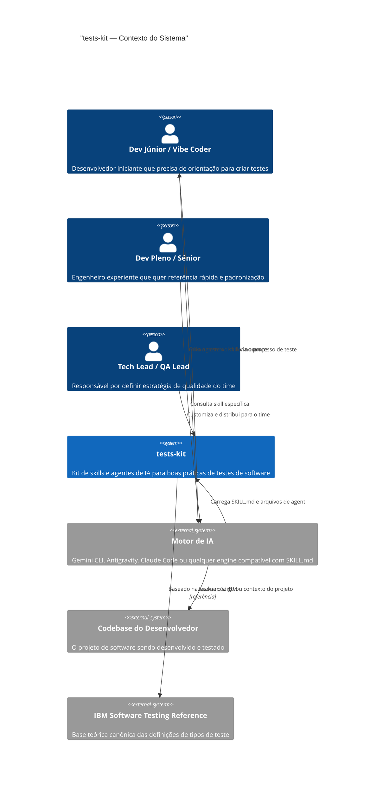
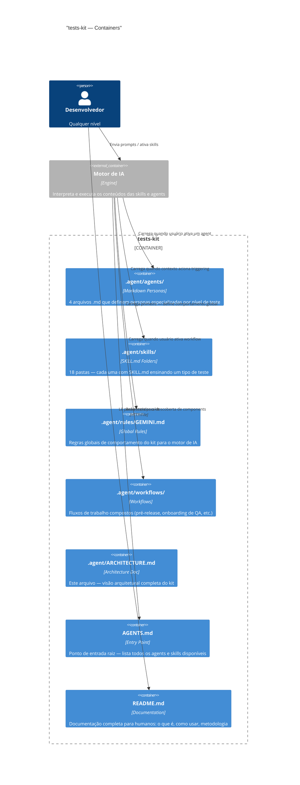
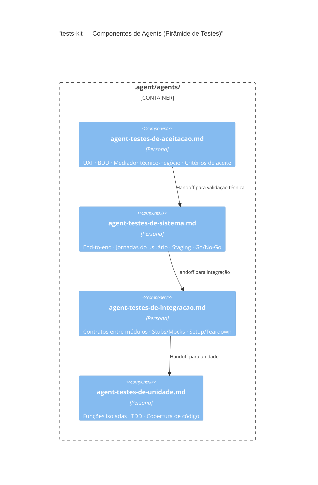
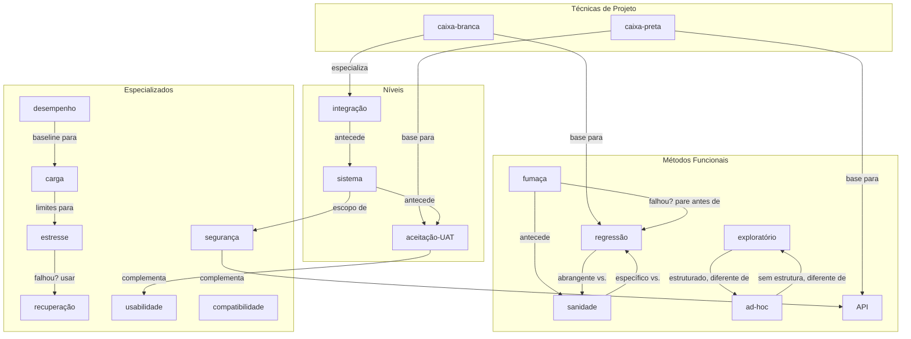
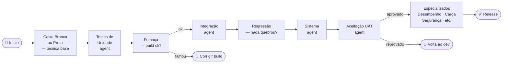

# ARCHITECTURE.md — tests-kit

> **Versão:** 1.0 | **Data:** 2026-04-30
> **Metodologia:** Spec-Driven Development (SDD) via Reversa Framework
> **Nível:** Documentação completa (C4 Context + Container + Component + ADRs + Matriz de Impacto)

---

## 1. Visão Arquitetural

O **tests-kit** é um **kit de conhecimento estruturado**, não um sistema de software com runtime. Sua "arquitetura" é composta de **artefatos de texto** (Markdown) organizados de forma que motores de IA possam carregar, interpretar e executar o conhecimento contido neles.

### Princípios Arquiteturais

| Princípio | Decisão |
|-----------|---------|
| **Portabilidade** | Nenhum arquivo depende de runtime específico — funciona em qualquer engine que leia Markdown |
| **Extensibilidade** | Nova skill = nova pasta. Zero modificação nos arquivos existentes |
| **Separação de responsabilidades** | Skills = conhecimento de execução · Agents = personas · Rules = comportamento global |
| **Agnóstico de linguagem** | Nenhum conteúdo refere linguagem de programação específica sem qualificação |
| **Segurança por design** | Cada skill é auditável isoladamente; nenhuma skill tem acesso ao sistema do usuário |

---

## 2. C4 — Nível 1: Contexto do Sistema

> *Como o tests-kit se encaixa no ecossistema do desenvolvedor*



---

## 3. C4 — Nível 2: Containers

> *Os principais blocos de construção do tests-kit*



---

## 4. C4 — Nível 3: Componentes

> *Organização interna dos containers — detalhamento de Skills e Agents*

### 4.1 Componentes de Skills

```mermaid
C4Component
    title "tests-kit — Componentes de Skills (por categoria IBM)"

    Container_Boundary(skills_container, ".agent/skills/") {

        Component_Boundary(tecnicas, "Técnicas de Projeto") {
            Component(caixa_branca, "teste-de-caixa-branca/SKILL.md", "Skill", "Cobertura de caminhos internos do código")
            Component(caixa_preta, "teste-de-caixa-preta/SKILL.md", "Skill", "Validação por comportamento externo")
        }

        Component_Boundary(funcionais, "Funcionais de Método") {
            Component(fumaca, "teste-de-fumaca/SKILL.md", "Skill", "Build verification — sistema está vivo?")
            Component(sanidade, "teste-de-sanidade/SKILL.md", "Skill", "Feature específica ainda funciona?")
            Component(regressao, "teste-de-regressao/SKILL.md", "Skill", "Nada quebrou com a mudança?")
            Component(exploratorio, "teste-exploratorio/SKILL.md", "Skill", "Sessão estruturada com charter e heurísticas")
            Component(ad_hoc, "teste-ad-hoc/SKILL.md", "Skill", "Exploração livre sem script")
            Component(api, "teste-de-API/SKILL.md", "Skill", "Contratos, endpoints, autenticação HTTP")
        }

        Component_Boundary(niveis, "Por Nível (Pirâmide)") {
            Component(integracao, "teste-de-integracao/SKILL.md", "Skill", "Comunicação entre módulos")
            Component(sistema, "teste-de-sistema/SKILL.md", "Skill", "Sistema completo end-to-end")
            Component(uat, "teste-de-aceitacao-do-usuario/SKILL.md", "Skill", "Validação com usuário/negócio")
        }

        Component_Boundary(especializados, "Não-Funcionais + Confiabilidade") {
            Component(recuperacao, "teste-de-recuperacao/SKILL.md", "Skill", "Resiliência e recuperação de falhas")
            Component(desempenho, "teste-de-desempenho/SKILL.md", "Skill", "Métricas de velocidade e throughput")
            Component(carga, "teste-de-carga/SKILL.md", "Skill", "Comportamento sob volume crescente")
            Component(estresse, "teste-de-estresse/SKILL.md", "Skill", "Ponto de colapso do sistema")
            Component(seguranca, "teste-de-seguranca/SKILL.md", "Skill", "Vulnerabilidades e OWASP Top 10")
            Component(usabilidade, "teste-de-usabilidade/SKILL.md", "Skill", "Experiência do usuário — heurísticas Nielsen")
            Component(compatibilidade, "teste-de-compatibilidade/SKILL.md", "Skill", "Cross-browser, cross-OS, cross-device")
        }
    }
```

### 4.2 Componentes de Agents



---

## 5. Mapa de Relacionamentos entre Skills

> *Quais skills se relacionam e como*



---

## 6. Fluxo de Ordem Recomendada

> *Em qual ordem usar as skills para um projeto típico*



---

## 7. ADRs — Architecture Decision Records

### ADR-001: Skills como Pastas (não arquivos únicos)

**Status:** Aceito  
**Data:** 2026-04-30

**Contexto:** Skills poderiam ser implementadas como arquivos `.md` únicos (ex: `caixa-branca.md`) ou como pastas com `SKILL.md` interno.

**Decisão:** Cada skill é uma **pasta** contendo `SKILL.md` e, opcionalmente, subpastas `references/`, `assets/`, `scripts/`.

**Consequências positivas:**
- Permite evolução futura: adicionar exemplos, templates ou scripts sem mudar a interface
- Consistente com o padrão do framework Antigravity 2.1 (referência)
- Extensível sem quebrar o contrato existente

**Consequências negativas:**
- Levemente mais verboso na estrutura de diretórios

---

### ADR-002: Agents como arquivos .md (não como skills)

**Status:** Aceito  
**Data:** 2026-04-30

**Contexto:** Agents poderiam seguir o mesmo formato de skills (pastas com SKILL.md). Porém, sua natureza é diferente — são **personas**, não **procedimentos**.

**Decisão:** Agents são arquivos `.md` simples na pasta `.agent/agents/`, sem subpastas.

**Consequências positivas:**
- Diferenciação clara entre "o que fazer" (skill) e "quem faz" (agent)
- Mais simples para o motor de IA carregar como contexto de persona
- Fácil customização pelo usuário final

**Consequências negativas:**
- Limitação: agents não podem ter references/ ou scripts/ (tradeoff aceitável para v1.0)

---

### ADR-003: Agnóstico de Linguagem de Programação

**Status:** Aceito  
**Data:** 2026-04-30

**Contexto:** Skills poderiam ter exemplos em linguagens específicas (Python, JavaScript, Java) para maior concretude.

**Decisão:** O corpo principal de cada `SKILL.md` é **agnóstico de linguagem**. Exemplos usam pseudocódigo ou descrição em prosa. Linguagens específicas só aparecem se o usuário explicitamente pede.

**Consequências positivas:**
- Maximiza portabilidade — uma skill funciona para qualquer stack
- Evita viés de linguagem (kit não parece "pythônico" ou "javascript-centric")
- Mais duradouro — não envelhece com mudanças de ecossistema

**Consequências negativas:**
- Exemplos menos concretos para o iniciante absoluto (mitigado pela progressividade das skills)

---

### ADR-004: Taxonomia IBM como Referência Canônica

**Status:** Aceito  
**Data:** 2026-04-30

**Contexto:** Diversas taxonomias de testes existem (ISTQB, Google Testing, IEEE 829). Qual usar?

**Decisão:** A **referência IBM** (`testes_de_software_IBM.pdf`) é a fonte primária para definição e categorização dos tipos de teste.

**Consequências positivas:**
- Base técnica sólida e reconhecida internacionalmente
- Cobre tanto testes funcionais quanto não-funcionais de forma equilibrada
- Referência disponível em português, reduzindo barreira de tradução

**Consequências negativas:**
- Alguns tipos de teste modernos (ex: contract testing, chaos engineering avançado) não estão na referência IBM — ficam para v2.0

---

### ADR-005: Separação entre GEMINI.md (rules) e AGENTS.md (entry point)

**Status:** Aceito  
**Data:** 2026-04-30

**Contexto:** As regras globais do kit e o índice de agents/skills poderiam estar no mesmo arquivo.

**Decisão:** Dois arquivos com responsabilidades distintas:
- `AGENTS.md` (raiz) — entry point para humanos E motores de IA; lista todos os agents e skills
- `.agent/rules/GEMINI.md` — regras de comportamento global do kit para o motor de IA

**Consequências positivas:**
- Separação clara entre "o que existe" (AGENTS.md) e "como se comportar" (GEMINI.md)
- AGENTS.md é o primeiro arquivo que qualquer motor de IA lê — deve ser informativo e conciso
- Permite atualizar regras sem mudar o índice (e vice-versa)

---

## 8. Spec Impact Matrix

> *Impacto de mudanças em cada componente sobre os demais*

| Se mudar... | Impacta | Ação necessária |
|------------|---------|-----------------|
| Template de `SKILL.md` (SDD-master) | Todas as 18 skills | Re-revisar todas as skills contra o novo template |
| `GEMINI.md` (rules global) | Comportamento de todos os agents e skills | Testar triggering de todas as skills |
| `AGENTS.md` (raiz) | Descoberta de agents e skills pelo motor | Verificar se novos agents/skills estão listados |
| Uma skill individual | Apenas a skill modificada | Apenas re-auditar a skill alterada |
| Um agent individual | Apenas o agent modificado | Verificar se handoffs ainda fazem sentido |
| Taxonomia IBM mapeada | SDD-master + todas as skills da categoria | Atualizar `categoria_ibm` no frontmatter |
| Pirâmide de testes | SDD-agents + ARCHITECTURE.md | Atualizar diagrama + relações de handoff |

---

## 9. Estratégia de Evolução (Versionamento Semântico)

| Versão | O que muda | Exemplo |
|--------|-----------|---------|
| **Patch** (1.0.x) | Correções de texto, gramática, exemplos | `1.0.1` — corrige descrição da skill de fumaça |
| **Minor** (1.x.0) | Nova skill ou agent, sem quebrar existentes | `1.1.0` — adiciona skill `teste-de-contrato` |
| **Major** (x.0.0) | Quebra de template, mudança de estrutura | `2.0.0` — skills com subpastas obrigatórias |

---

## 10. Checklist Arquitetural de Validação

Antes de cada release, verificar:

- [ ] Todas as 18 skills têm `SKILL.md` com frontmatter completo
- [ ] Todos os 4 agents têm arquivo `.md` com contrato de persona
- [ ] `AGENTS.md` lista todas as skills e agents
- [ ] `GEMINI.md` está atualizado com regras correntes
- [ ] `ARCHITECTURE.md` reflete a estrutura atual (este documento)
- [ ] `README.md` está completo e revisado
- [ ] Todos os diagramas Mermaid renderizam sem erro
- [ ] Todos os ADRs estão com status atualizado
- [ ] Auditoria de segurança (skill-injection-auditor) executada em todas as skills
- [ ] Git: commits semânticos para cada mudança
